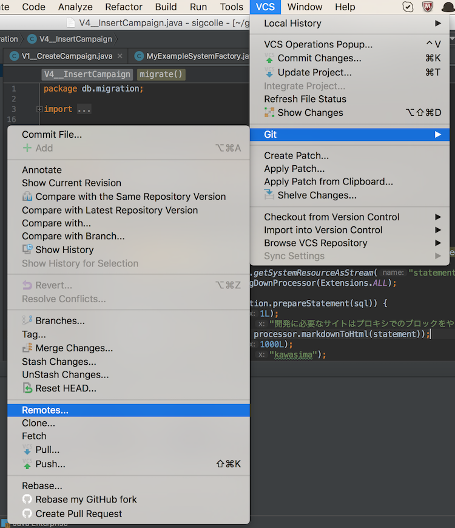
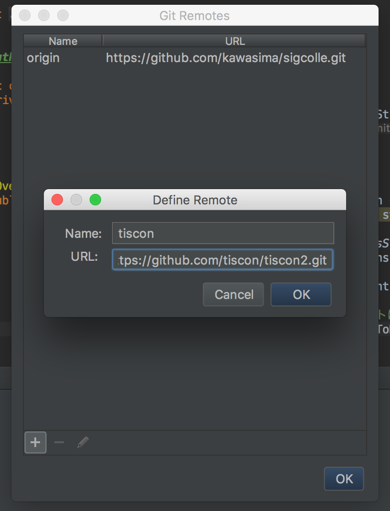
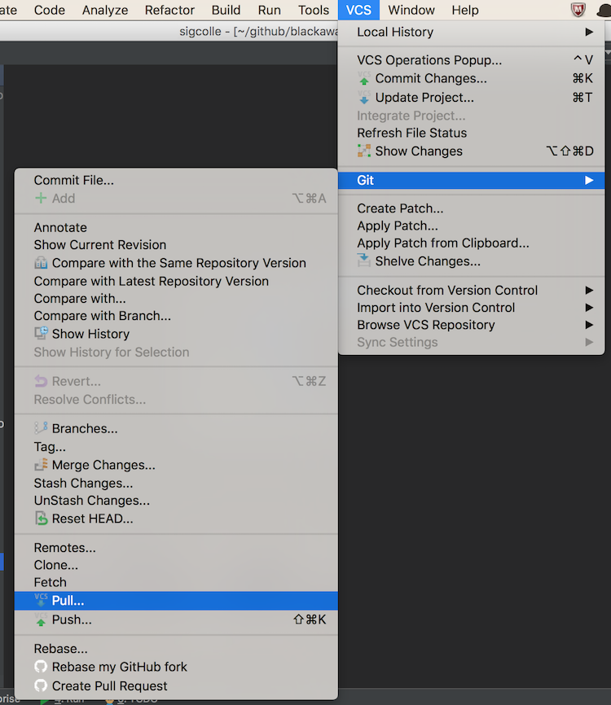
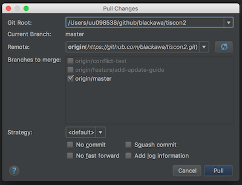

# 更新手引き

fork元の本家リポジトリ( https://github.com/tiscon/tiscon2 ) に更新があった時、それを自分のリポジトリに取り込む手順です。

## 前提条件

[Gitルーキートラの巻](GitForRookies.md)を一読してある、もしくは内容が分かること。

## 本家リポジトリを参照できるようにする( `git remote add` )

https://github.com/tiscon/tiscon2.git を tiscon という名前でリモートリポジトリに追加します。

IntelliJで `VCS` > `Git` > `Remotes` をクリック。

nameに `tiscon` 、 URLに `https://github.com/tiscon/tiscon2.git` と入力してOKをクリック。

## 本家リポジトリの変更を取り込む

tisconのmasterブランチをローカルのmasterブランチにダウンロードします。

IntelliJで `VCS` > `Git` > `Pull` をクリック。

Pullのオプションを選ぶ画面が表示されるので、

Pullをクリック。

もし「File Merged with Conflicts」という以下のようなメッセージが表示されたら、本家リポジトリの変更内容とローカルの変更内容が競合しています。

`Merge` ボタンをクリックして変更内容を確認し、残しておきたい方の変更を取り込んでください。

## 自分のリポジトリに変更をアップロードする

[ローカルリポジトリの内容をアップロードpushする | Gitルーキートラの巻 :tiger:](GitForRookies.md#ローカルリポジトリの内容をアップロードpushする)と同様の手順で、originリポジトリに変更をPushしてください。
